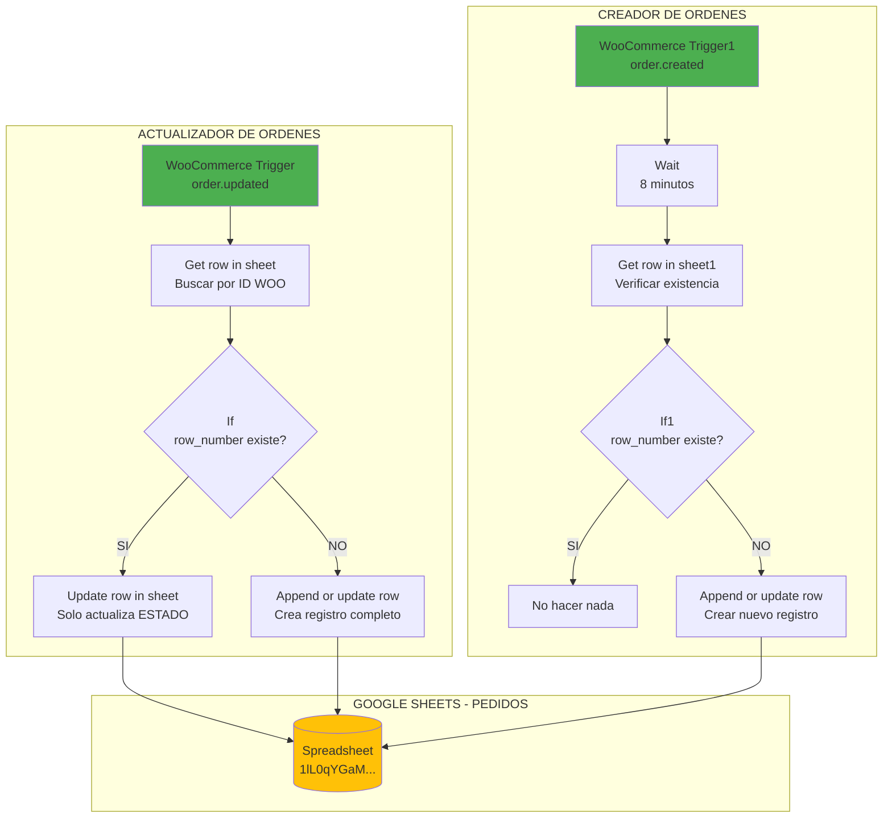
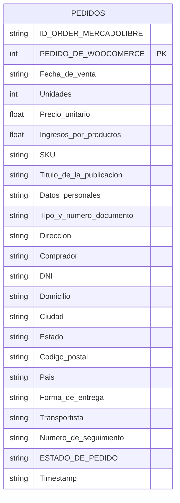
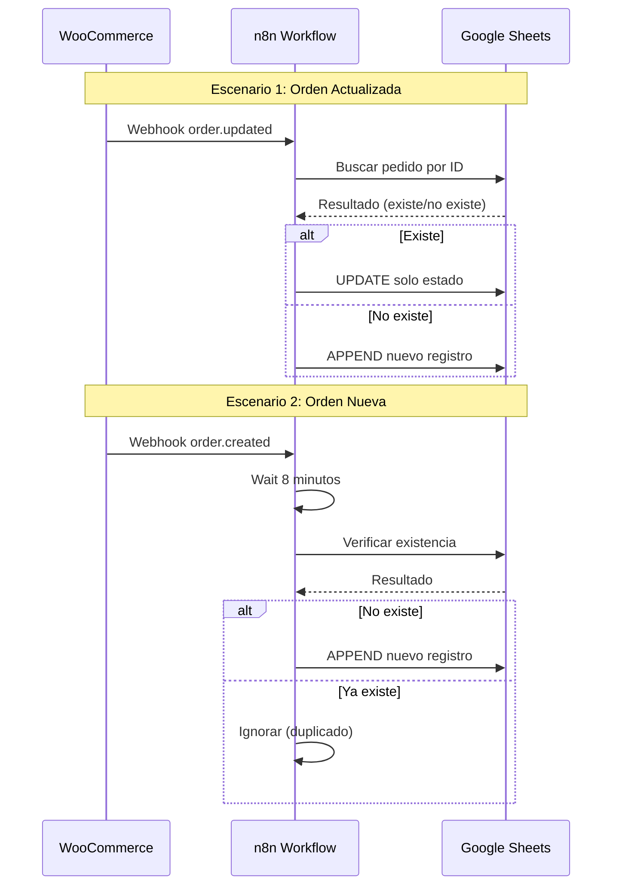

# DIAGRAMA - ACTUALIZADOR DE ESTADO (nwxle9rOLTNWgH9i)

## Flujo Principal

## Estructura de Datos

## Secuencia de Eventos

## Campos Mapeados

| Campo Google Sheets | Origen WooCommerce | Transformacion |
|--------------------|--------------------|----------------|
| PEDIDO DE WOOCOMERCE | json.id | Directo |
| Fecha de venta | date_created | toLocaleString('es-AR') |
| Unidades | line_items[].quantity | reduce sum |
| Precio unitario | total / unidades | Calculado |
| Ingresos | total | Directo |
| SKU | line_items[].sku | join(', ') |
| Titulo | shipping_lines.meta_data.value | Regex parse |
| Datos personales | shipping.first_name + billing.last_name | Concatenado |
| Estado | status | Directo |
| Timestamp | date_created | Formato personalizado |
