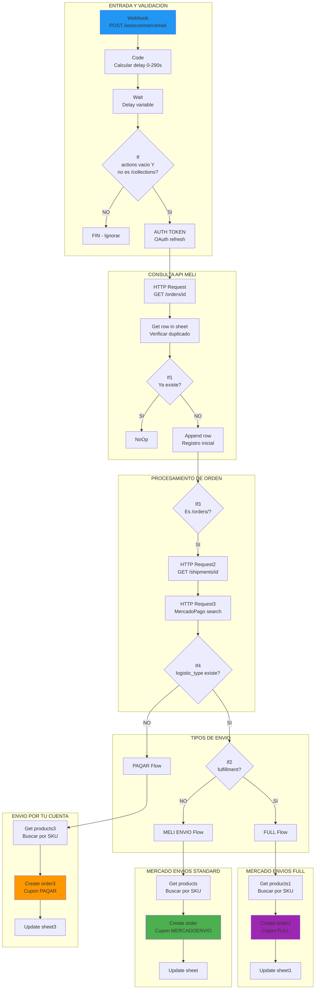
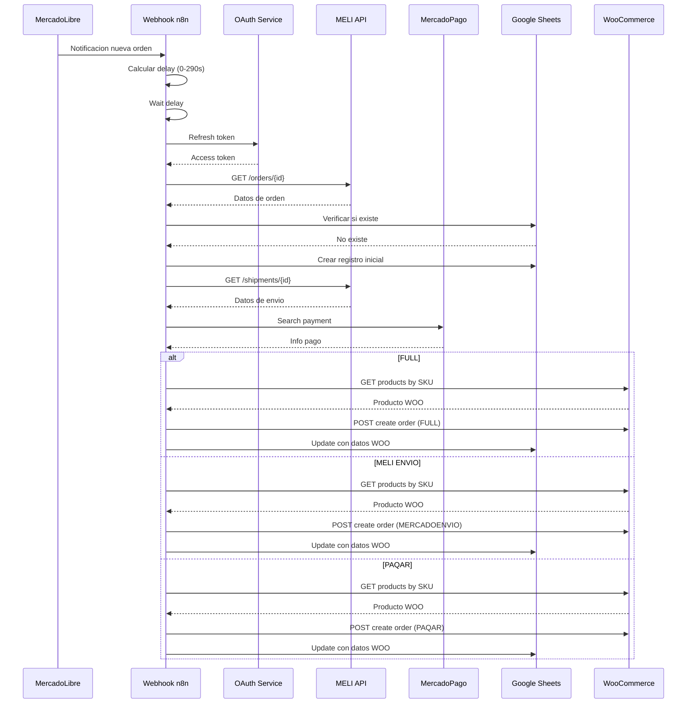
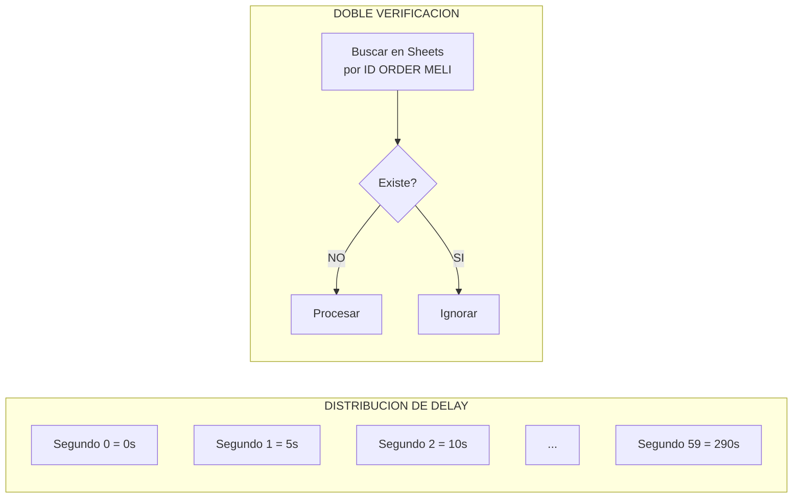

# DIAGRAMA - REPLICADOR DE PEDIDOS MELI a WOO (e77BVblQZV7FBmm1)

## Flujo Principal



## Secuencia de Replicacion



## Mecanismo Anti-Duplicacion



## Estructura de Orden WooCommerce Generada

```json
{
  "status": "on-hold",
  "payment_method_title": "Mercadolibre",
  "transaction_id": "{pack_id|order_id}",
  "customer_note": "PEDIDO DE MERCADOLIBRE\n{TIPO_ENVIO}\nVENTA #{id}\nCOMPRADOR: {nickname}\nPRODUCTO: ({qty}) {title}\nSKU: {sku}\nTOTAL: ${amount}\nTRACKING: {url}",
  "billing": {
    "first_name": "{buyer.first_name}",
    "last_name": "{buyer.last_name}",
    "company": "{buyer.nickname}",
    "address_1": "{receiver_address.address_line}",
    "city": "{city}, {state}",
    "postcode": "{zip_code}",
    "country": "AR"
  },
  "shipping": { "...similar..." },
  "line_items": [{
    "product_id": "{woo_product_id}",
    "quantity": "{meli_qty}",
    "subtotal": "{unit_price / 1.21 * qty}"
  }],
  "coupon_lines": [{
    "code": "FULL|MERCADOENVIO|PAQAR"
  }]
}
```

## Mapeo de Tipos de Logistica

| logistic_type MELI | Cupon WOO | Caracteristicas |
|-------------------|-----------|-----------------|
| fulfillment | FULL | Stock en deposito MELI, envio gestionado por MELI |
| cross_docking | MERCADOENVIO | Retira MELI de vendedor |
| drop_off | MERCADOENVIO | Vendedor lleva a sucursal |
| xd_drop_off | MERCADOENVIO | Similar drop_off |
| (error/vacio) | PAQAR | Envio por cuenta del vendedor |
