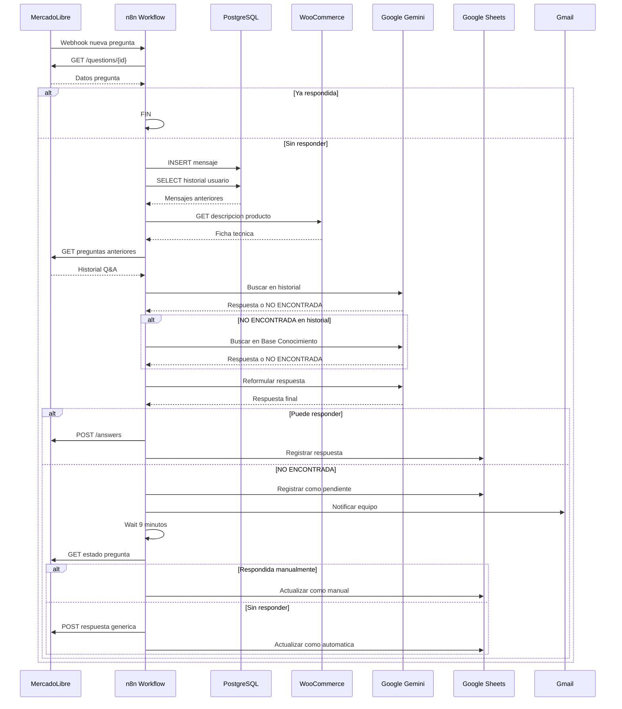
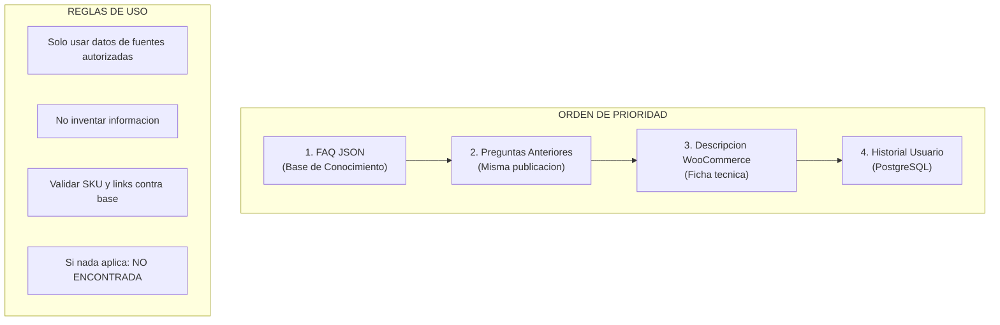
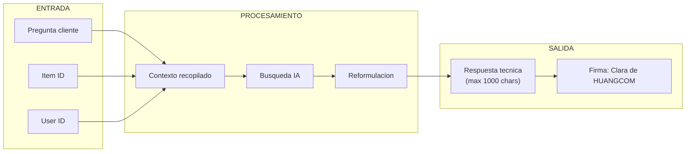
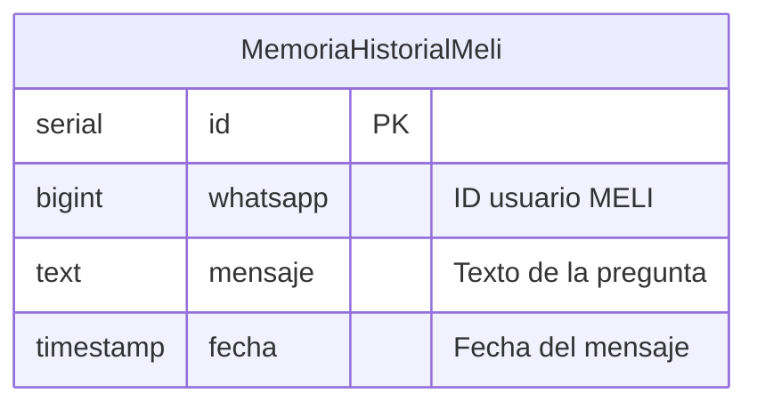

# DIAGRAMA - AGENTE MERCADOLIBRE (Clara) (JOCJm5xLqMjar1YP)

## Arquitectura del Agente

```mermaid
flowchart TB
    subgraph ENTRADA["RECEPCION DE PREGUNTA"]
        A1[Webhook<br/>POST /preguntas] --> A2[AUTH TOKEN1<br/>OAuth MELI]
        A2 --> A3[HTTP Request<br/>GET pregunta]
        A3 --> A4{If2<br/>Ya respondida?}
        A4 -->|SI| A5[FIN]
        A4 -->|NO| A6[Continuar proceso]
    end

    subgraph MEMORIA["SISTEMA DE MEMORIA"]
        A6 --> B1[Insert PostgreSQL<br/>Guardar mensaje]
        B1 --> B2[Select PostgreSQL<br/>Historial usuario]
        B2 --> B3[Aggregate<br/>Consolidar mensajes]
    end

    subgraph CONTEXTO["RECOPILACION DE CONTEXTO"]
        B3 --> C1[Get description<br/>Sub-workflow WOO]
        C1 --> C2[Preguntas Anteriores<br/>API MELI]
        C2 --> C3[Code1<br/>Parsear Q&A]
        C3 --> C4[Aggregate5<br/>Consolidar]
    end

    subgraph IA_BUSQUEDA["BUSQUEDA EN HISTORIAL"]
        C4 --> D1[Search in History<br/>Google Gemini]
        D1 --> D2{isNoEncontrada5<br/>Encontro respuesta?}
        D2 -->|SI| D3[Edit Fields7<br/>Fuente: Preguntas]
        D2 -->|NO| D4[Base Conocimientos<br/>Google Gemini]
    end

    subgraph IA_BASE["BASE DE CONOCIMIENTO"]
        D4 --> E1{isNoEncontrada<br/>Encontro en FAQ?}
        E1 -->|SI| E2[Edit Fields<br/>Fuente: Base]
        E1 -->|NO| E3[Edit Fields5<br/>Fuente: WOO]
    end

    subgraph REFORMULACION["RESPUESTA FINAL"]
        D3 --> F1[Edit Fields6<br/>Consolidar]
        E2 --> F1
        E3 --> F1
        F1 --> F2[Description actual<br/>Google Gemini]
        F2 --> F3{If1<br/>Puede responder?}
    end

    subgraph RESPUESTA_OK["RESPUESTA EXITOSA"]
        F3 -->|SI| G1[answer1<br/>Preparar]
        G1 --> G2[Code/Code2<br/>Formatear fecha]
        G2 --> G3[SEND HTTP ANSWER3<br/>Responder MELI]
        G3 --> G4[Append sheet6<br/>Registrar]
    end

    subgraph NO_ENCONTRADA["NO ENCONTRADA"]
        F3 -->|NO| H1[answer3<br/>Preparar]
        H1 --> H2[Append row sheet<br/>Registrar]
        H2 --> H3[Send Gmail<br/>Notificar equipo]
        H3 --> H4[Wait 9min<br/>Ventana intervencion]
        H4 --> H5[HTTP Request1<br/>Verificar estado]
        H5 --> H6{If<br/>Ya respondida?}
        H6 -->|SI| H7[Update sheet<br/>Respuesta manual]
        H6 -->|NO| H8[SEND ANSWER2<br/>Mensaje generico]
        H8 --> H9[Update sheet1<br/>Respuesta auto]
    end

    style A1 fill:#2196F3
    style D1 fill:#9C27B0
    style D4 fill:#9C27B0
    style F2 fill:#9C27B0
    style G3 fill:#4CAF50
    style H8 fill:#FF9800
```

## Secuencia de Procesamiento

## Jerarquia de Fuentes de Informacion

## Estructura de Respuesta

## Base de Datos PostgreSQL

## Google Sheets - Registro de Respuestas

| Campo | Descripcion |
|-------|-------------|
| FECHA DE PREGUNTA | Timestamp formateado |
| ESTADO | Respondida por IA / No Encontrada / Respondida |
| PREGUNTA | Texto original del cliente |
| RESPUESTA REFORMULADA | Respuesta final enviada |
| RESPUESTA TECNICA | Respuesta cruda de IA |
| FUENTE CONSULTADA | Base / Preguntas / WOO |
| TITULO DE LA PUBLICACION | Nombre del producto |
| ITEM ID | ID de publicacion MELI |
| LINK DE MERCADOLIBRE | URL de la publicacion |
| SKU | Codigo interno |
| LINK DE HUANGCOM.COM | URL en tienda propia |
| ID USUARIO | ID del comprador |
| ID PREGUNTA | ID unico de la pregunta |

## Prompts de IA Utilizados

### Prompt 1: Busqueda en Historial
- **Objetivo**: Encontrar si la pregunta ya fue respondida
- **Input**: Historial JSON + Pregunta nueva
- **Output**: Respuesta encontrada o "NO ENCONTRADA"

### Prompt 2: Base de Conocimiento
- **Objetivo**: Buscar en FAQ estructurado
- **Categorias**: Bombas, Paneles, Climatizadores, Kits, etc.
- **Output**: Respuesta tecnica o "NO ENCONTRADA"

### Prompt 3: Reformulacion Final
- **Objetivo**: Estructurar respuesta para MELI
- **Restricciones**: Max 1000 chars, sin links externos, firma Clara
- **Output**: Respuesta lista para enviar
